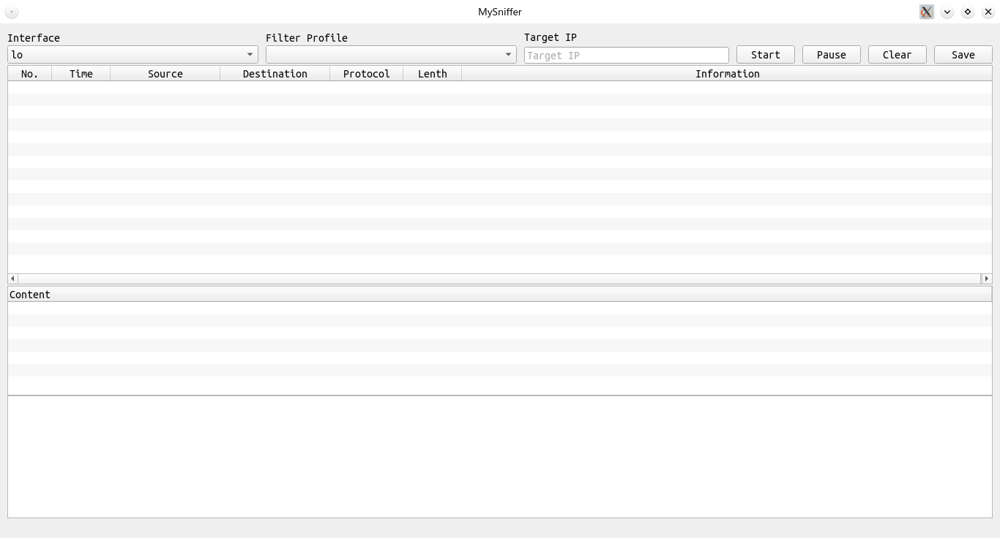
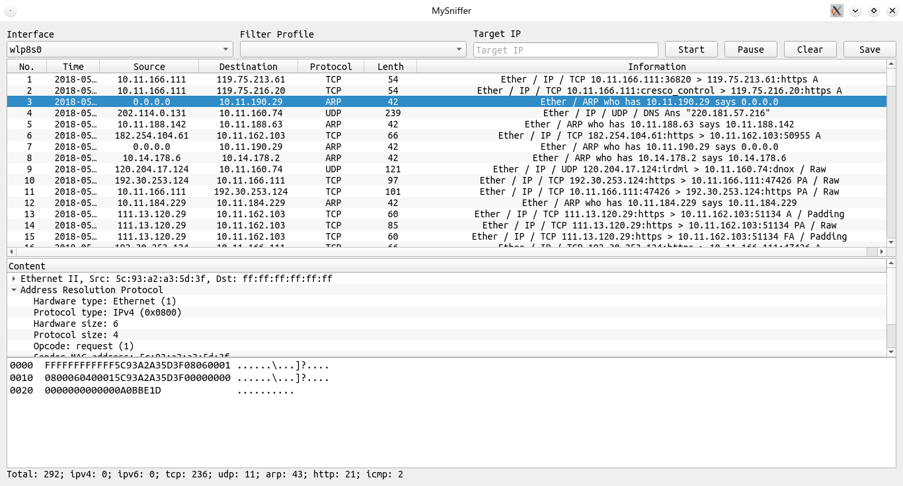
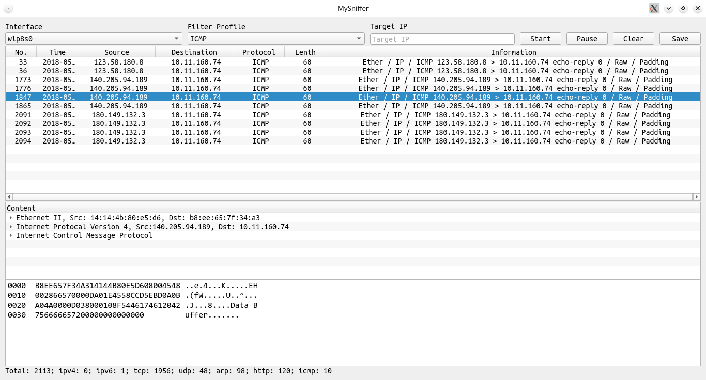

# Sniffer_pyqt5
A sniffer built on pyqt5
# How to run?
1. install [SortFilterProxyModel](https://github.com/oKcerG/SortFilterProxyModel/issues/37)
    ```shell
    $ cd plugin/SortFilterProxyModel
    $ qmake
    $ make
    $ sudo mkdir /usr/qml/QQSFPM/
    $ sudo cp libqmlqsortfilterproxymodelplugin.so /usr/qml/QQSFPM/
    $ sudo cp qmldir /usr/qml/QQSFPM/
    please change /usr/qml/ to where your qml plugins were installed. 
    ```
    
2. Instll pyqt5 and scapy 
    ``` shell
    $ pip install pyqt5
    $ pip install scapy
    ```
    
3. Run
    ```shell
    $ sudo python main.py
    ```
    If you want to save pdf, you need to install pyx

    
    
    